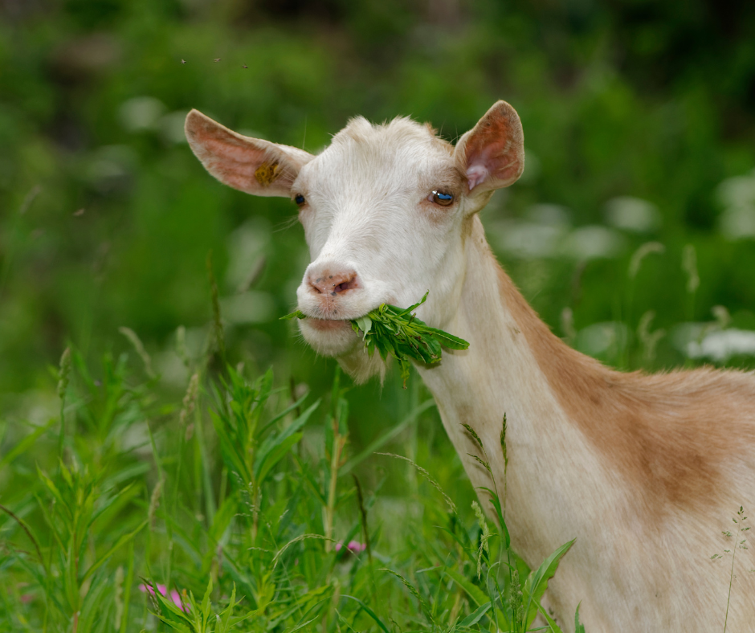
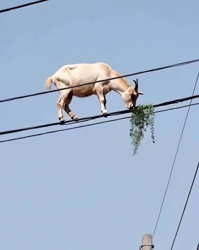

# This is a list of Recipes for GOATS!!!

Goats like to eat many things.

Goats like to eat fresh green grass!

Goats favorite food may or may not be fiber optics.

## Recipe for power line grass

### Recipe

- Grass
- Power line

### Preparation

Grow grass on a power line

### Serving

Mount goat on power line, next to grass
Goats jump very high and they like to jump on the top of the house, barns and trees!

## Recipe for Grass For Goats

### Ingredients

- Grass
- (optional) Lemon

### Preparation

ummmmm grow some grass

### Serving

Serve the grass to Goats with a side of lemon for freshness.
